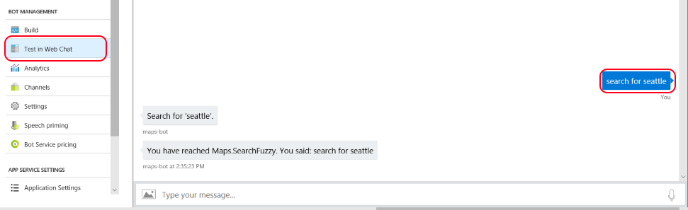

In this guide we will build a sample Bot service that will remotely control the MapApplication using text input. This service can also be enabled as Cortana skill to support voice commands.

## Create a Language Understanding bot with Bot Service

1. In the Azure portal, select Create new resource in the menu blade and click See all.
2. In the search box, search for Web App Bot.
3. In the Bot Service blade, provide the required information, and click Create. This creates and deploys the bot service and LUIS app to Azure.
    * Set App name to your bot’s name. The name is used as the subdomain when your bot is deployed to the cloud (for example, mymapbot.azurewebsites.net). This name is also used as the name of the LUIS app associated with your bot. Copy it to use later, to find the LUIS app associated with the bot.
    * Select the subscription, resource group, App service plan, and location.
    * Select the Language understanding (C#) template for the Bot template field.
    
    * Check the box to confirm to the terms of service.
4. Confirm that the bot service has been deployed.
    * Click Notifications (the bell icon that is located along the top edge of the Azure portal). The notification will change from **Deployment started** to **Deployment succeeded**.
    * After the notification changes to **Deployment succeeded**, click **Go to resource** on that notification.

## Try the bot

Confirm that the bot has been deployed by checking the **Notifications**. The notifications will change from **Deployment in progress...** to **Deployment succeeded**. Click **Go to resource** button to open the bot's resources blade.

Once the bot is registered, click Test in Web Chat to open the Web Chat pane. Type "hello" in Web Chat. The bot responds by saying "1: You said hello". This confirms that the bot has received your message and passed it to a default LUIS app that it created. This default LUIS app detected a Greeting intent.

## Modify the LUIS app
Log in to [LUIS.ai](https://www.luis.ai) using the same account you use to log in to Azure. Click on **My apps**. In the list of apps, find the app that begins with the name specified in **App name** in the **Bot Service** blade when you created the Bot Service.

The LUIS app starts with 4 intents: Cancel, Greeting, Help, and None.

The following steps add the Maps.SearchFuzzy, Maps.ZoomIn, and Maps.ZoomOut intents:
1. Click the **Create new intent** button, set the name as **Maps.SearchFuzzy** and click **Done**.
    * Add the following utterances _Go to Seattle_, _Show me Seattle_, _Search for Seattle_.
	* Create **Location** entity. To do that click the word _Seattle_ in the first utterance, wait for the context menu to show up and type _location_. In the popup dialog select **Simple** entity type.
    
    * Repeat the sequence for each occurrence of _Seattle_ in other utterances. However, this time choose existing **location** entity at the bottom of context menu.

    

2. Add intents with names **Maps.ZoomIn** and **Maps.ZoomOut** each having one utterance - _Zoom in_ and _Zoom out_ respectively.
3. In the **Intents** page, click on each of the following intent names and then click the **Delete Intent** button.
	* Cancel
	* Greeting
	* Help
		
	The only intents that should remain in the LUIS app are the following:
	* Maps.SearchFuzzy
	* Maps.ZoomIn
	* Maps.ZoomOut
	* None

    

4. Click the **Train** button in the upper right to train your app.

5. Click **PUBLISH** in the top navigation bar to open the **Publish** page. Click the **Publish to production** slot button. After successful publish, copy the URL displayed in the **Endpoint** column the **Publish App** page, in the row that starts with the Resource Name Starter_Key. 

## Modify the bot code

1. Open bot service in Azure portal. Click **Build** and then click **Open online code editor**.
    
2. In the code editor, open BasicLuisDialog.cs. By default it contains sample intent handlers.
3. Add the following using statement in BasicLuisDialog.cs.

    ```using Microsoft.Azure.Devices;```

4. Add the following code within the BasicLuisDialog class, after the constructor definition.

```CSharp
    [LuisIntent("Maps.SearchFuzzy")]
    public async Task MoveIntent(IDialogContext context, LuisResult result)
    {
        EntityRecommendation location;
 
        if (result.TryFindEntity("location", out location))
        {
            await context.PostAsync($"Search for '{location.Entity}'.");
            await InvokeIotDeviceMethod("SearchFuzzy", $"\"{location.Entity}\"");
            }
            else
            {
                await context.PostAsync("Where would you like to go?");
            }
 
            await this.ShowLuisResult(context, result);
        }
 
        [LuisIntent("Maps.ZoomIn")]
        public async Task ZoomInIntent(IDialogContext context, LuisResult result)
        {
            await context.PostAsync($"Zooming in.");
            await InvokeIotDeviceMethod("ZoomIn");
            await this.ShowLuisResult(context, result);
        }
 
        [LuisIntent("Maps.ZoomOut")]
        public async Task ZoomOutIntent(IDialogContext context, LuisResult result)
        {
            await context.PostAsync($"Zooming out.");
            await InvokeIotDeviceMethod("ZoomOut");
            await this.ShowLuisResult(context, result);
        }
 
        public async Task InvokeIotDeviceMethod(string methodName, string body = null, TimeSpan? timeout = null)
        {
            ServiceClient serviceClient = ServiceClient.CreateFromConnectionString(ConfigurationManager.AppSettings["IoTHubConnectionString"]);
 
            var method = new CloudToDeviceMethod(methodName, timeout ?? TimeSpan.FromSeconds(10))
            {
                ConnectionTimeout = TimeSpan.FromSeconds(5)
            };
 
            if (!string.IsNullOrEmpty(body))
            {
                method.SetPayloadJson(body);
            }
 
            await serviceClient.InvokeDeviceMethodAsync("map-display", method); // set device name here to the one you provisioned in IoT hub
        }

```

5. Add nuget packages with IoT client library 
```
  <package id="Microsoft.Azure.Amqp" version="2.1.3" targetFramework="net46" />
  <package id="Microsoft.Azure.Devices" version="1.4.1" targetFramework="net46" />
  <package id="Microsoft.Azure.Devices.Shared" version="1.3.0" targetFramework="net46" />
```

6. Add the following references to any of _ItemGroup_ elements
```
    <Reference Include="Microsoft.Azure.Amqp, Version=2.1.0.0, Culture=neutral, PublicKeyToken=31bf3856ad364e35, processorArchitecture=MSIL">
      <HintPath>packages\Microsoft.Azure.Amqp.2.1.3\lib\net45\Microsoft.Azure.Amqp.dll</HintPath>
    </Reference>
    <Reference Include="Microsoft.Azure.Devices, Version=1.0.0.0, Culture=neutral, PublicKeyToken=31bf3856ad364e35, processorArchitecture=MSIL">
      <HintPath>packages\Microsoft.Azure.Devices.1.4.1\lib\net451\Microsoft.Azure.Devices.dll</HintPath>
    </Reference>
    <Reference Include="Microsoft.Azure.Devices.Shared, Version=1.0.0.0, Culture=neutral, PublicKeyToken=31bf3856ad364e35, processorArchitecture=MSIL">
      <HintPath>packages\Microsoft.Azure.Devices.Shared.1.3.0\lib\net45\Microsoft.Azure.Devices.Shared.dll</HintPath>
   </Reference>
```

7. Add the following binding redirect to the <assemblyBinding> section of **web.config**
```
    <dependentAssembly>
        <assemblyIdentity name="Microsoft.Azure.Amqp" publicKeyToken="31bf3856ad364e35" culture="neutral" />
        <bindingRedirect oldVersion="0.0.0.0-2.1.0.0" newVersion="2.1.0.0" />
    </dependentAssembly>
 ```

## Build the bot
Right-click on build.cmd in the code editor and choose Run from Console.


### Update IoT hub connection string
1. Open Azure Portal and navigate to IoT hub instance where you device is connected to (created in part 1).
2. Open 'Shared access policies' tab and select the 'service' policy.
3. Copy connection string with primary or secondary key.
4. Go back to the web application with your bot's name and open 'application settings'.
5. Add new setting with the name 'IoTHubConnectionString' and value copied from the Iot hub.


## Test the bot
In the Azure Portal, click on **Test in Web Chat** to test the bot. Try typing messages "search for Seattle", "Zoom in", "Zoom out".



The app should respond and display search results or zoom map content.


**Tip**

If your bot code runs into an issue, check the following:
* You have [built the bot](https://docs.microsoft.com/en-us/azure/bot-service/dotnet/bot-builder-dotnet-luis-dialogs?view=azure-bot-service-3.0#build-the-bot).
* Your bot code defines a handler for every intent in your LUIS app.

If you find that your bot doesn't always recognize the correct intent or entities, improve your LUIS app's performance by giving it more example utterances to train it. You can retrain your LUIS app without any modification to your bot's code.

For instance, add more utterances to Map.SearchFuzzy intent with different 'location' part. E.g. "search for Boston", "search for New York", "search for London". Make sure location entity is marked in every utterance too. See [Add example utterances](https://docs.microsoft.com/en-us/azure/cognitive-services/LUIS/add-example-utterances) and [train and test your LUIS app](https://docs.microsoft.com/en-us/azure/cognitive-services/LUIS/train-test).

## Next steps
Register Cortana channel in bot settings and test map application control using voice commands.

[Connect an existing bot to Cortana](https://docs.microsoft.com/en-us/azure/bot-service/bot-service-channel-connect-cortana?view=azure-bot-service-3.0)
