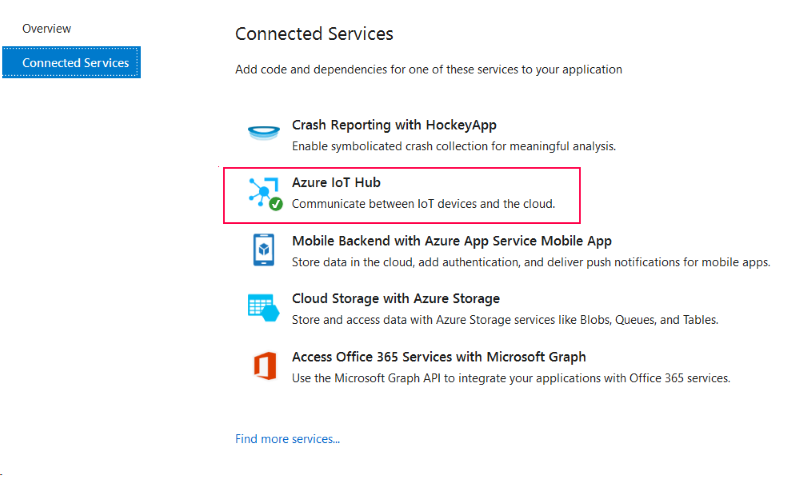
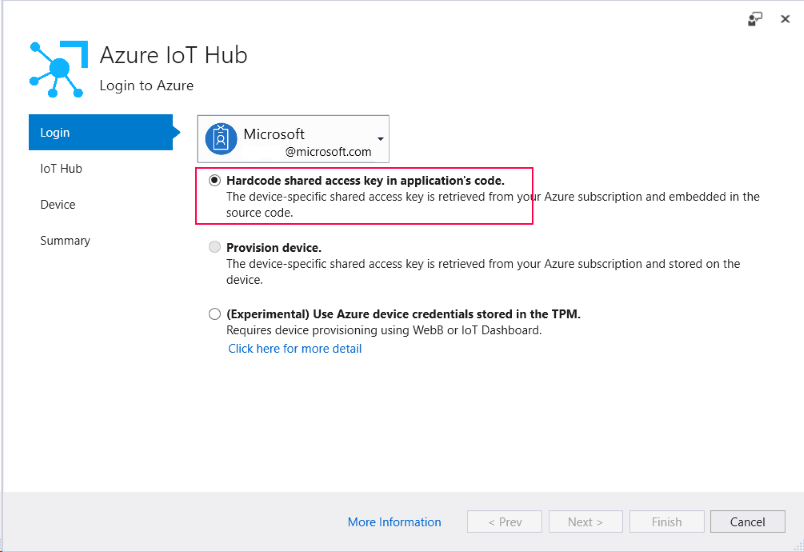
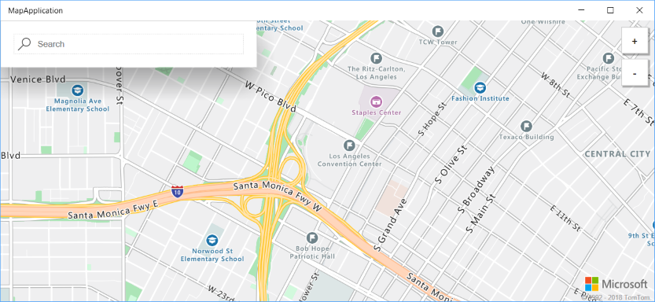
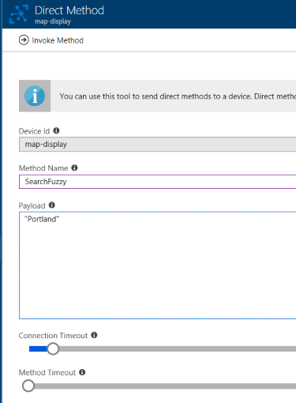

# Developing a .NET UWP application using Azure Maps, IoT hub and Bot service

This is a sample application that shows how Azure Maps, IoT hub and Bot service API can work together. We will extend the Azure Maps browser application to create a remotely controlled interactive map using Azure IoT and Azure Maps services.

## Repository content

[MapApplication](https://github.com/Azure-Samples/azure-maps-dotnet-webgl-uwp-iot-remote-control/tree/master/MapApplication) contains source code for the sample UWP application that uses Azure Maps to display map control and connects to Azure IoT hub as a device to receive commands.

[MapBot](https://github.com/Azure-Samples/azure-maps-dotnet-webgl-uwp-iot-remote-control/tree/master/MapBot) contains source for the sample ASP.NET application using Bot framework and LUIS service to accept user input and connects to Azure IoT as a service to send commands to UWP application.

## Prerequisites

Before you can run this sample, you must have the following prerequisites:

* An active Azure account. If you don't have one, you can sign up for a [free account](https://azure.microsoft.com/free/).
* Windows 10 Creators Update (Build 15063)
* Visual Studio 2017
* Universal Windows Platform tools for VS2017
* ASP.NET and web development tools for VS2017

## Getting started

1. Clone this repository using `git clone git@github.com:azure-samples/azure-maps-dotnet-webgl-uwp-iot-remote-control.git`
2. Open `MapApplication\MapApplication.sln` in VS2017.
3. Setup device connection string
    * Make sure you have [IoT Hub connected service extension for VS](https://marketplace.visualstudio.com/items?itemName=MicrosoftIoT.ConnectedServiceforAzureIoTHub) installed.
    * Right click **MapApplication** project in solution explorer and select **Add > Connected service** menu item
    * In the dialog that opens choose **Azure IoT hub**
    
    * Sign in with account that has access to Azure subscription, select **Hardcode shared access key** got to the next step.
    
    * On the **IoT hub** tab select existing or provision new IoT hub instance.
    * On **Device** tab create new device named `map-display` and select **Finish**.
    * This extension will have requied nuget package installed and `deviceConnectionString` property in AzureIoTHub.cs populated with a connection string for `map-display`.
    * Open AzureIoTHub.cs and add the following method at the end of the class definition:
    ```CSharp
    public static async Task RegisterDirectMethodAsync(string methodName, Func<string, Task> action)
    {
        CreateClient();

        System.Diagnostics.Debug.WriteLine($"Registering a callback for {methodName}");
        await deviceClient.SetMethodHandlerAsync(methodName,
            async delegate (MethodRequest methodRequest, object userContext)
            {
                System.Diagnostics.Debug.WriteLine($"{methodName} has been called");
                try
                {
                    await action(methodRequest.DataAsJson);
                    return new MethodResponse(200);
                }
                catch (Exception ex)
                {
                    return new MethodResponse(Encoding.UTF8.GetBytes(ex.ToString()), 500);
                }
            }, null);
    }
    ```
    * Property `deviceConnectionString` in AzureIoTHub.cs will contain a connection string populated with SAS for device `map-display`.
    
4. Setup Azure Maps web control
    * Get your Azure Maps account key. If you don't have one, please follow instructions in [demo app quickstart](https://docs.microsoft.com/en-us/azure/azure-maps/quick-demo-map-app) to create account and obtain the account key.
    * Open AzureMapDemo.html and find the following section:
    ```Javascript
    var subscriptionKey = "<replace with your Azure Maps account key>";
        var map = new atlas.Map("map", {
            "subscription-key": subscriptionKey,
            center: [-118.270293, 34.039737],
            zoom: 14
        });
    ```
    * Replace `subscriptionKey` value with your Azure Maps account key.

## Running the app

1. Select build platform x64 for the project MapApplication.
2. Build the MapApplication and click Run.

Your main window should display map and a search box:



Try sending direct commands from your IoT hub instance. Implemented commands are "SearchFuzzy" (expects search term as body text), "ZoomIn" and "ZoomOut".



At this point you have built a functioning UWP application which displays the map and responds to remote commands from IoT hub.

## Setting up bot service

You can following steps from [Creating MapBot service with LUIS](https://github.com/Azure-Samples/azure-maps-dotnet-webgl-uwp-iot-remote-control/blob/master/Docs/create-luis-bot-with-bot-service.md) to setup your instance of bot service that communicates with MapApplication via IoT hub.

Alternatively, you could build and deploy bot service using source code available in the [MapBot](https://github.com/Azure-Samples/azure-maps-dotnet-webgl-uwp-iot-remote-control/MapBot) subfolder.

### Build and debug

1. Clone repository or download source code and extract in local folder
2. Open `MapBot\Microsoft.Azure.Maps.Sample.LuisBot.sln` in Visual Studio
3. Build and run the bot
4. Download and run [botframework-emulator](https://emulator.botframework.com/)
5. Connect the emulator to http://localhost:3987

### Publish to Azure

* In Visual Studio, right click on `Mapbot\Microsoft.Azure.Maps.Sample.LuisBot.sln` and select 'Publish'
* Follow dialog steps to create App service instance and upload the code

## More information

- [Azure Maps Documentation](https://docs.microsoft.com/en-us/azure/azure-maps/)
- [How to use the Azure Maps Map Control](https://docs.microsoft.com/en-us/azure/azure-maps/how-to-use-map-control)
- [Azure IoT Hub Documentation](https://docs.microsoft.com/azure/iot-hub/)

